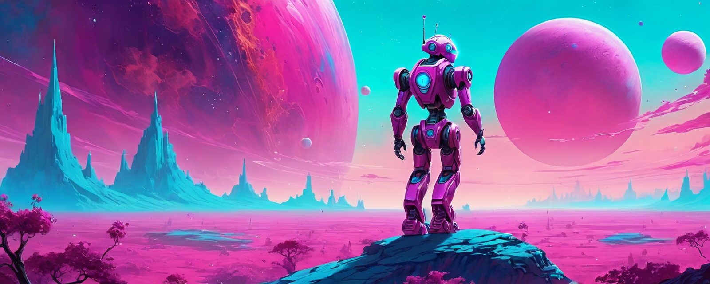

  
  <h1 align="center">4DC</h1>
  
4DC is a multipurpose discord.js v14 bot created for the <a href="https://discord.gg/UtQjHuTJeA">ContentCreator</a> Discord server.

  
  
  

  

# Note
- This repo is actively being maintained and updated to include the latest discord.js releases and Discord API changes
- While this project and all of its code is free to use and modify, it was created soley to run on a specific server and would not work elsewhere without some heavy modifying beforehand
- The ContentCreator Discord server isn't for support for this project. [Contact me on Discord](https://discord.com/users/438434841617367080) privately if you have any questions

# License
4DC is licensed under the **[GPL-3.0 License](./LICENSE)**
